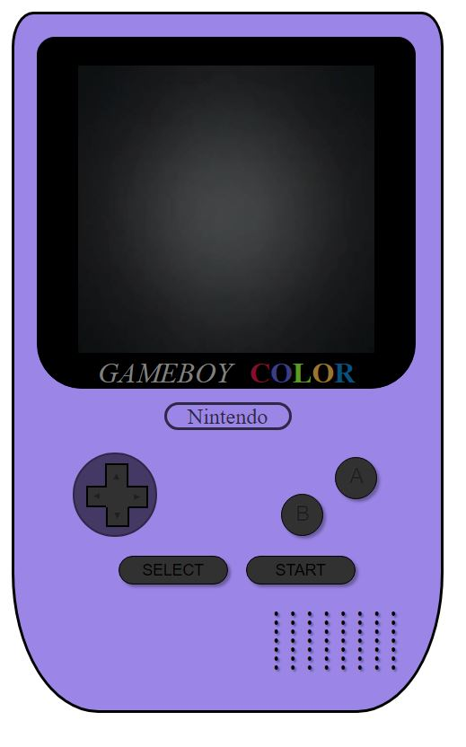
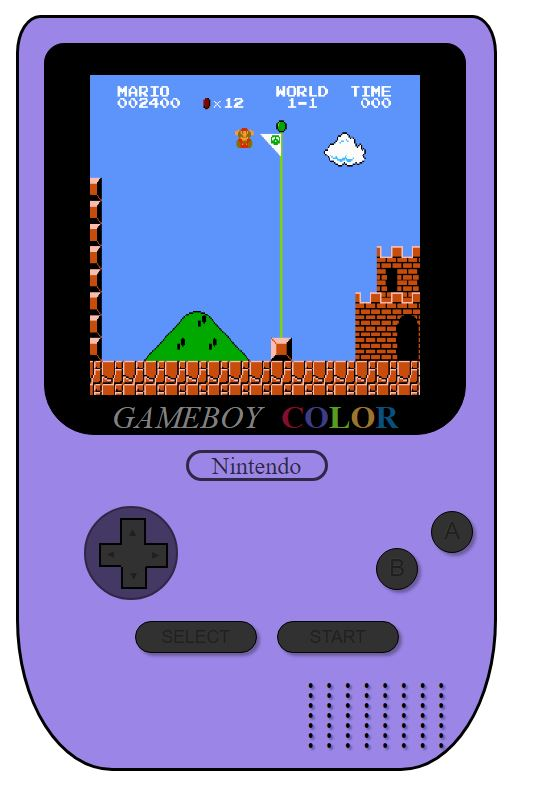

## 📝 Tabla de Contenidos

- [Instruducción](#Instruducción)
- [Pre-requisitos](#Pre-requisitos)
- [Construido con](#Construido)
- [Uso](#uso)
- [Demo](#Demo)
- [Capturas de Pantalla](#CapturasdePantalla)
- [Contacto](#Contacto)

## Intruducción 🧐 

Mi primer proyecto realizado en el Bootcamp Full Stack Developer en el que tenía que realizar una videoconsola utilizando HTML, CSS y Javascript. En mi caso he elegido una Gameboy Color, espero que el resultado os guste 😁.

## Pre-requisitos 📋 

    · Editor de Texto -> Visual Studio Code
    · Descargarse la extensión de Live Server para Visual Studio Code o tener XAMPP

## Construido con 🛠️ 

Este proyecto ha sido creando utilizando los siguientes lenguajes;

    · HTML
    · CSS
    · JavaScript

## Uso 🛠️

    El uso de la aplicación es sencillo. Al entrar veremos la aplicación sin ningun video en la pantalla de la Gameboy, pero al darle clic al botón START se mostrará un GIF del Mario Bros. Para volver a quitar ese GIF tendremos que darle clic al botón SELECT.

## Demo 👀 

Para visualizar la demo <a href="https://raulscz10.github.io/gameboy-html-css/" target="_blank"> clic aqui </a>.
## Capturas de Pantalla  📸 

A continuación os dejo una preview de como ha quedado el proyecto.

Gameboy con el GIF desactivado.

Gameboy con el GIF activado.

## Contacto 📧 

En caso de que tengáis alguno o queráis hacer algún aporte al código, podéis escribirme a mi correo.

    · raulscz10@gmail.com
